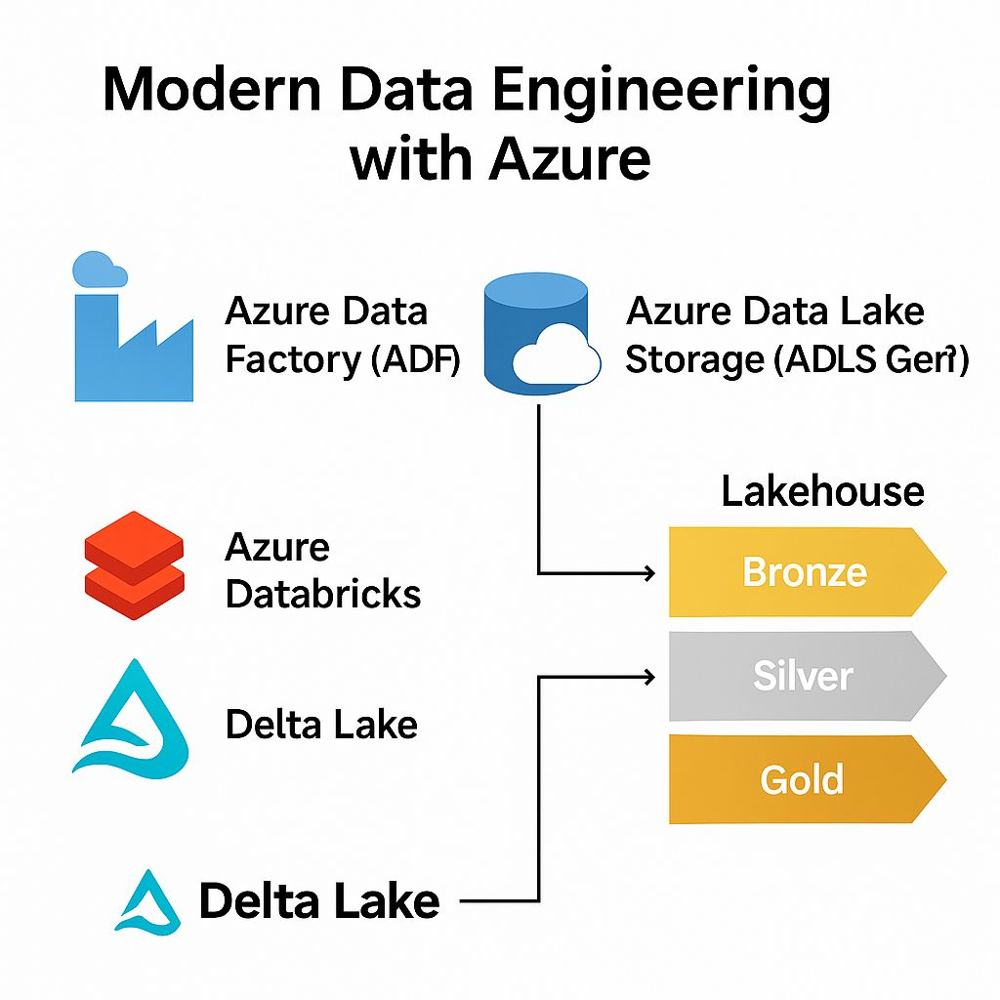

# Data Ingestion into Data Lakehouse
## Visão Geral
Criação de um pipeline de ingestão e transformação de dados em um Data Lake (ADLS Gen2), com processamento em Azure Databricks (PySpark), orquestração em Azure Data Factory e visualização em Power BI.
## Objetivos
- Armazenar dados brutos em um Data Lake
- Realizar processso de ELT com Azure Data Factory e Apache Spark
- Servir dados limpos para visualização em Power BI
## Tecnologias
- Azure Data Lake Storage Gen2
- Azure Data Factory
- Databricks
- PySpark
- Power BI
## Arquitetura

## Como Executar
1. Provisionar recursos no Azure usando Bicep ou Terraform.
2. Carregar dados de exemplo em `data/` para o Data Lake.
3. Rodar os notebooks Databricks.
4. Executar o pipeline Data Factory (`pipelines/`).
5. Abrir o dashboard em `powerbi/sales_dashboard.pbix`.
## Requisitos
- Teste